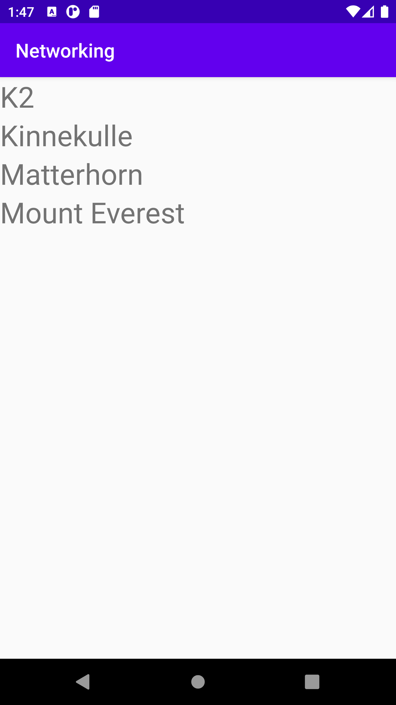

# Rapport

I started by createing a list_item to style how the items should look and then  i
edited MainActivity so it would use everything i was going to create, then i made a Mountain to
structure how i wanted to represent a mountain, after that i made the adapter and added the
listview in activity_main and by getting error when trying to run it i remembered to add
internet permissions in the manifest

this is the onPostExecute function:
```
Gson gson = new Gson();
Type type = new TypeToken<List<Mountain>>() {}.getType();
mountainAdapter.setMountains((List<Mountain>) gson.fromJson(json, type));
recyclerView.getAdapter().notifyDataSetChanged();
```

